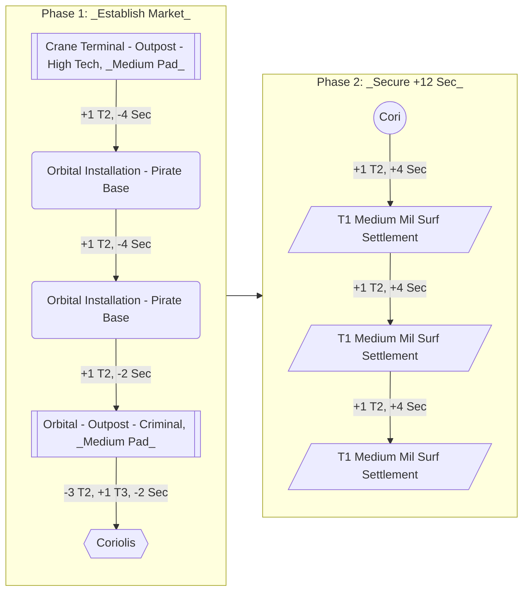

# Crime Nebula Project

__Goal:__ Produce Contraband commodities local to North America Nebula.

__System:__ `North America Sector RO-Q B5-4`

---

## System Plan

__Origin Station:__ `Crane Terminal | High Tech`

### Phase Statistics

#### Phase 1

| Build | Security | TechLv | Wealth | SoL | DevLv |
| --: | --: | ---: | --: | ---: | ---: |
| Pirate Base | -4 | | +4 | | |
| Pirate Base | -4 | | +4 | | |
| Criminal Outpost | -2 | | +3 | | |
| Coriolis | -2 | +2 | +3 | +3 | +3 |
| __Total__ | __-12__ | __+2__ | __+14__ | __+3__ | __+3__ |

#### Phase 2

| Build | Security | TechLv | Wealth | SoL | DevLv |
| --: | --: | ---: | --: | ---: | ---: |
| Med Mil Settlement | +4 | | | | |
| Med Mil Settlement | +4 | | | | |
| Med Mil Settlement | +4 | | | | |
| __Total__ | __+12__ | | | | |

#### Summary

| Phase | Security | TechLv | Wealth | SoL | DevLv |
| --: | --: | ---: | --: | ---: | ---: |
| Phase 1 | -12 | +2 | +14 | +3 | +3 |
| Phase 2 | +12 | 0 | 0 | 0  | 0 |
| __Total__ | __0__ | __+2__ | __+14__ | __+3__ | __+3__ |

---

## Execution

- [ ] Pirate Base 1
- [ ] Pirate Base 2
- [ ] Criminal Outpost
- [ ] Coriolis
- [ ] Medium Military Surface Settlement 1
- [ ] Medium Military Surface Settlement 2
- [ ] Medium Military Surface Settlement 3